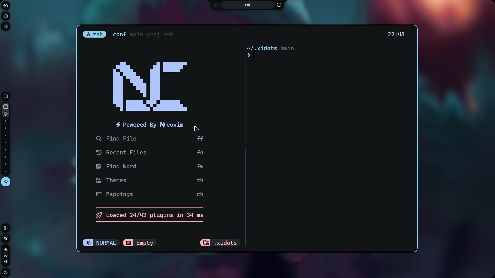
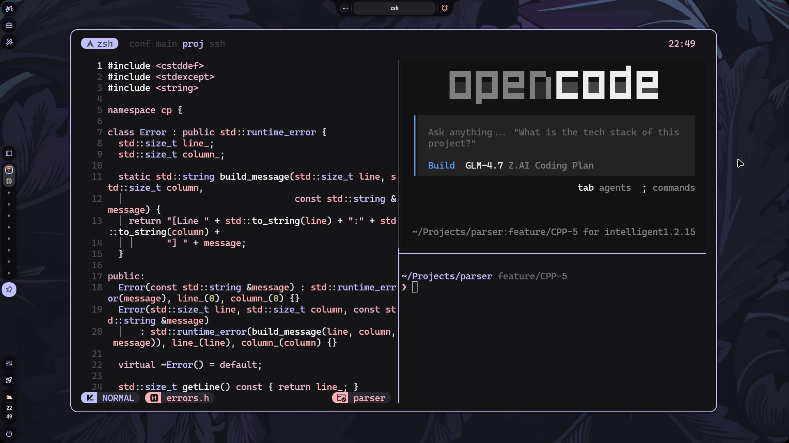
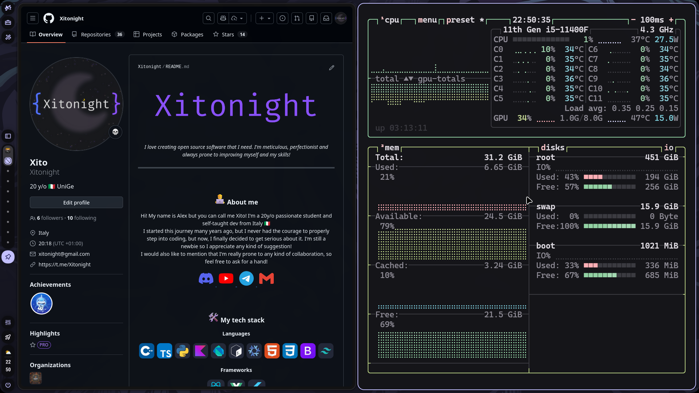
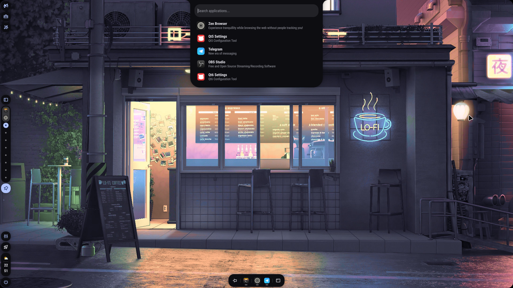

# Xidots

My personal dotfiles. Not meant to be cloned and used out of the box.

These dots reflect my very personal preferences—everything from packages to configs, keybinds, and themes. They're here to serve as a base for you to adapt and build your own setup.

## Installation

The really, REALLY, <ins>**REALLY**</ins> encouraged and intended way of installing this repo is <ins>manually</ins> cloning, backing up old files and copying the desired ones from the repo.

```bash
git clone https://github.com/Xitonight/Xidots.git ~/.xidots
```

If you truly want an automated way to install EVERYTHING from the repo, i created an install script. It only works on Arch Linux and you should NOT use it. 

⚠️ **GIANT DISCLAIMER: DO NOT RUN THIS AUTOINSTALL SCRIPT BLINDLY** ⚠️

It will **overwrite your existing dotfiles** and install everything according to **my preferences**, not yours.

Heavily adapted to my needs. Not suited for general public use. Read through the files and adapt them to your own setup before running anything.

If you really want to proceed (and you've backed up your current config):

```bash
curl -fsSL https://raw.githubusercontent.com/Xitonight/Xidots/main/install.sh | bash
```

But seriously, don't.

<h2><sub></sub> Screenshots</h2>

<table align="center">
  <tr>
    <td colspan="3"></td>
  </tr>
  <tr>
    <td colspan="1"></td>
    <td colspan="1"></td>
    <td colspan="1"></td>
  </tr>
</table>
